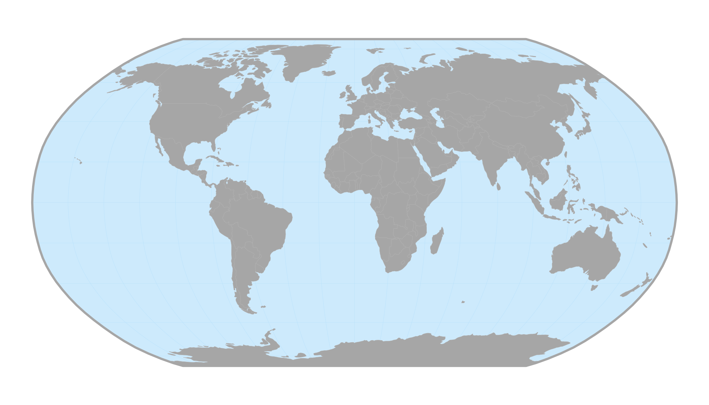
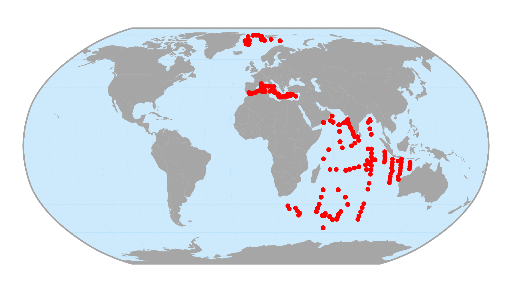
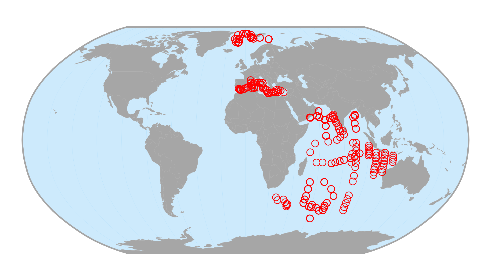
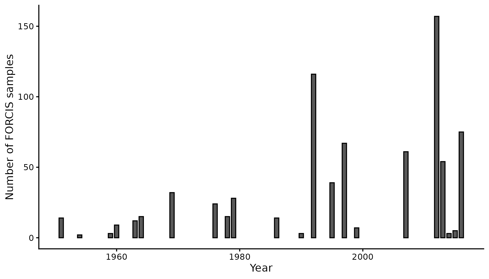
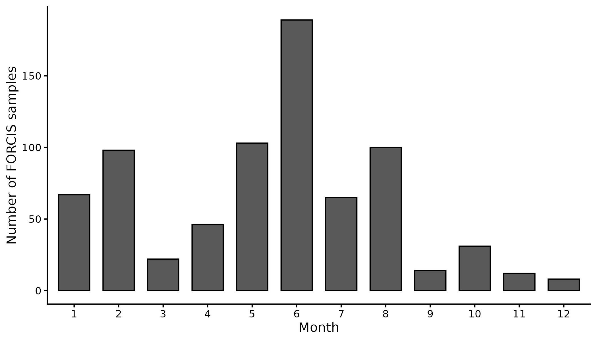
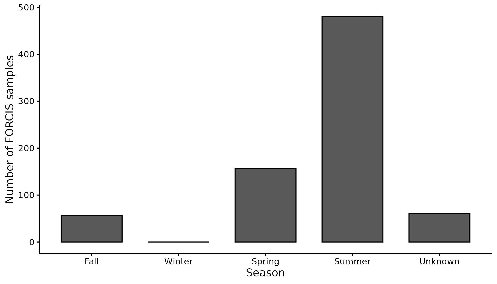
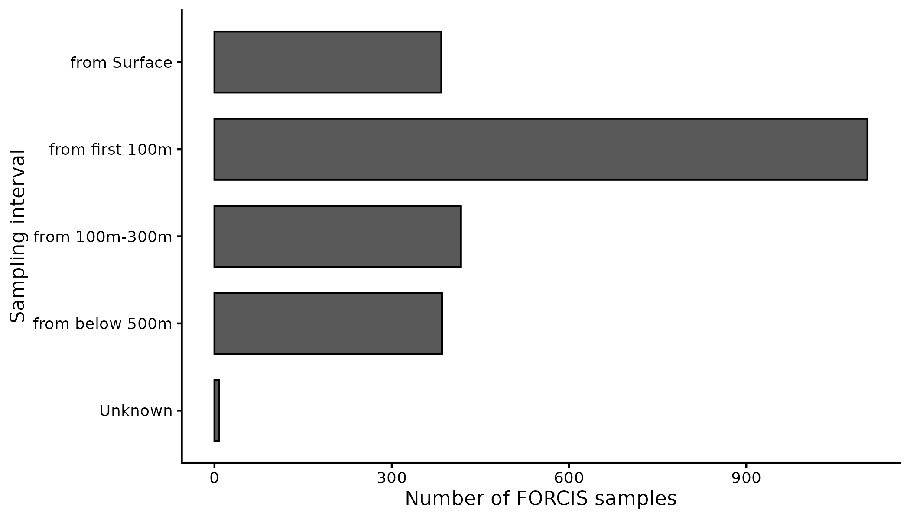

# Data visualization

The package `forcis` provides [numerous
functions](https://docs.ropensci.org/forcis/reference/index.html#visualization-tools)
to visualize FORCIS data. This vignette shows how to use and customize
these functions.

## Setup

First, let’s import the required packages.

``` r

library(forcis)
library(ggplot2)
```

Before proceeding, let’s download the latest version of the FORCIS
database.

``` r

# Create a data/ folder ----
dir.create("data")

# Download latest version of the database ----
download_forcis_db(path = "data", version = NULL)
```

The vignette will use the plankton net data of the FORCIS database.
Let’s import the latest release of the data.

``` r

# Import net data ----
net_data <- read_plankton_nets_data(path = "data")
```

**NB:** In this vignette, we use a subset of the plankton net data, not
the whole dataset.

## Spatial visualization

### Creating a world map

The function
[`geom_basemap()`](https://docs.ropensci.org/forcis/reference/geom_basemap.md)
can be used to easily add World countries, oceans and bounding box to a
`ggplot2` object.

``` r

# World basemap ----
ggplot() +
  geom_basemap()
```



These layers come from the [Natural
Earth](https://www.naturalearthdata.com/) website and are defined in the
[Robinson projection](https://epsg.io/54030).

### Mapping FORCIS data

The function
[`ggmap_data()`](https://docs.ropensci.org/forcis/reference/ggmap_data.md)
can be used to plot FORCIS data on a World map. Let’s map the plankton
nets data.

``` r

# Map raw net data ----
ggmap_data(net_data)
```



User can customize the aesthetic of the data:

``` r

# Customize map ----
ggmap_data(net_data, col = "#ff0000", fill = NA, shape = 21, size = 3)
```



This function works with the output of various functions available in
the `forcis` package. For example:

``` r

# Filter net data ----
net_data_indian <- filter_by_ocean(net_data, ocean = "Indian Ocean")

# Map filtered data ----
ggmap_data(net_data_indian)
```

Note that the `forcis` package is pipe-friendly.

``` r

# Same as before, but w/ the pipe ----
net_data |>
  filter_by_ocean(ocean = "Indian Ocean") |>
  ggmap_data()
```

You can export this map with the function
[`ggsave()`](https://ggplot2.tidyverse.org/reference/ggsave.html) of the
package `ggplot2`.

``` r

# Map filtered data ----
net_data_indian_map <- net_data |>
  filter_by_ocean(ocean = "Indian Ocean") |>
  ggmap_data() +
  ggtitle("FORCIS net data - Indian Ocean")

# Save as PNG ----
ggsave(
  net_data_indian_map,
  filename = "net_data_indian_map.png",
  width = 20,
  height = 11,
  units = "cm",
  dpi = 300,
  scale = 1.5,
  bg = "white"
)
```

## Temporal visualization

### Plot data by year of sampling

The function
[`plot_record_by_year()`](https://docs.ropensci.org/forcis/reference/plot_record_by_year.md)
plots the number of records (y-axis) by year (x-axis).

``` r

# Plot number of records by year ----
plot_record_by_year(net_data)
```



### Plot data by month of sampling

The function
[`plot_record_by_month()`](https://docs.ropensci.org/forcis/reference/plot_record_by_month.md)
plots the number of records (y-axis) by month (x-axis).

``` r

# Plot number of records by month ----
plot_record_by_month(net_data)
```



### Plot data by season

The function
[`plot_record_by_season()`](https://docs.ropensci.org/forcis/reference/plot_record_by_season.md)
plots the number of records (y-axis) by season (x-axis).

``` r

# Plot number of records by season ----
plot_record_by_season(net_data)
```



## Vertical visualization

### Plot data by depth of sampling

The function
[`plot_record_by_depth()`](https://docs.ropensci.org/forcis/reference/plot_record_by_depth.md)
plots the number of records (x-axis) by depth intervals (y-axis).

``` r

# Plot number of records by depth ----
plot_record_by_depth(net_data)
```


