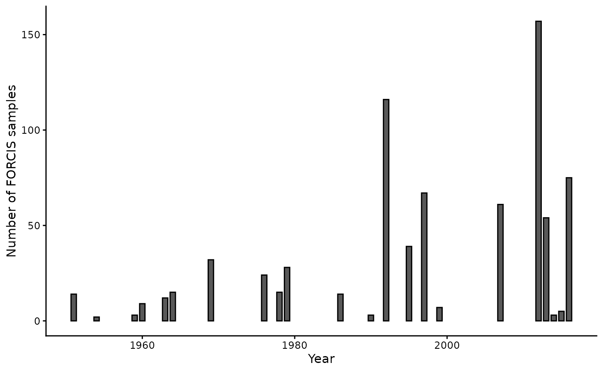
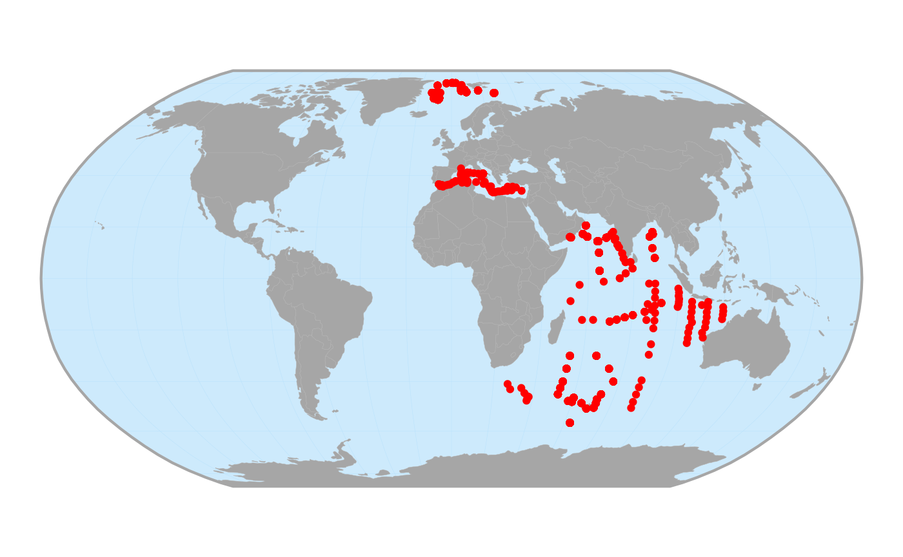
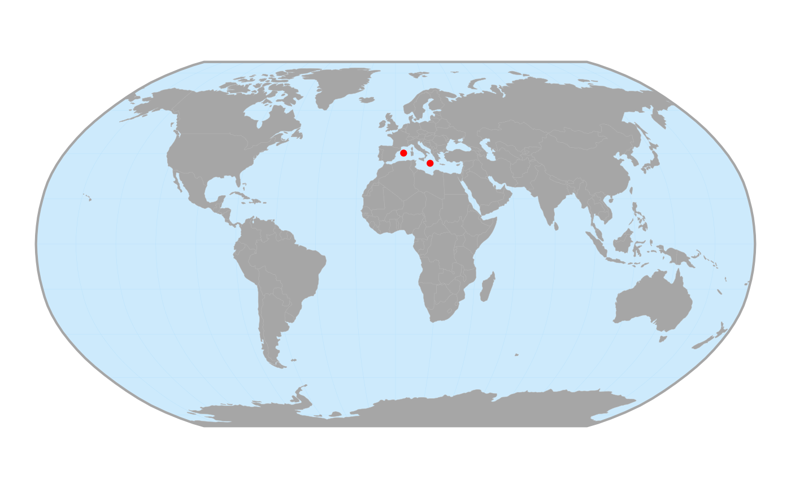

# Get started

The R package `forcis` is an interface to the [FORCIS
database](https://zenodo.org/doi/10.5281/zenodo.7390791) on global
foraminifera distribution (Chaabane et al. 2023). This database includes
data on living planktonic foraminifera diversity and distribution in the
global oceans from 1910 until 2018 collected using plankton tows,
continuous plankton recorder, sediment traps and plankton pump from the
global ocean.

This package has been developed for researchers interested in working
with the FORCIS database, even without advanced R skills. It provides
basic functions to facilitate the handling of this large database,
including functions to download, select, filter, homogenize, and
visualize the data. It also enables users to explore the spatial
distribution and temporal evolution of planktonic foraminifera.

This vignette is an overview of the main features of the package.

## Installation

To install the `forcis` package, run:

``` r

## Install < remotes > package (if not already installed) ----
if (!requireNamespace("remotes", quietly = TRUE)) {
  install.packages("remotes")
}

## Install dev version of < forcis > from GitHub ----
remotes::install_github("FRBCesab/forcis")
```

> The `forcis` package depends on the
> [`sf`](https://r-spatial.github.io/sf/) package which requires some
> spatial system libraries (GDAL and PROJ). Please read [this
> page](https://github.com/r-spatial/sf?tab=readme-ov-file#installing)
> if you have any trouble to install `forcis`.

Now let’s attach the required packages.

``` r

library(forcis)
```

## Download FORCIS database

The FORCIS database consists of a collection of five `csv` files hosted
on [Zenodo](https://zenodo.org/doi/10.5281/zenodo.7390791). These `csv`
are regularly updated and we recommend to use the latest version

Let’s download the latest version of the FORCIS database with
[`download_forcis_db()`](https://docs.ropensci.org/forcis/reference/download_forcis_db.md):

``` r

# Create a data/ folder in the current directory ----
dir.create("data")

# Download latest version of the database ----
download_forcis_db(
  path = "data",
  version = NULL
)
```

By default (i.e. `version = NULL`), this function downloads the latest
version of the database. The database is saved in
`data/forcis-db/version-99/`, where `99` is the version number.

**N.B.** The package `forcis` is designed to handle the versioning of
the database on Zenodo. Read the [Database
versions](https://docs.ropensci.org/forcis/articles/database-versions.html)
for more information.

## Import FORCIS data

In this vignette, we will use the plankton nets data of the FORCIS
database. Let’s import the latest release of the data.

``` r

# Import plankton nets data ----
net_data <- read_plankton_nets_data(path = "data")
```

``` r

# Print data ----
net_data
#> # A tibble: 2,451 × 86
#>    data_type cruise_id    profile_id sample_id sample_min_depth sample_max_depth
#>    <chr>     <chr>        <chr>      <chr>                <dbl>            <dbl>
#>  1 Net       ATLANTIS_II… ATLANTIS_… ATLANTIS…                0               86
#>  2 Net       ATLANTIS_II… ATLANTIS_… ATLANTIS…                0               86
#>  3 Net       ATLANTIS_II… ATLANTIS_… ATLANTIS…                0              118
#>  4 Net       ATLANTIS_II… ATLANTIS_… ATLANTIS…                0              106
#>  5 Net       ATLANTIS_II… ATLANTIS_… ATLANTIS…                0              118
#>  6 Net       ATLANTIS_II… ATLANTIS_… ATLANTIS…                0               86
#>  7 Net       ATLANTIS_II… ATLANTIS_… ATLANTIS…                0               64
#>  8 Net       ATLANTIS_II… ATLANTIS_… ATLANTIS…                0               73
#>  9 Net       ATLANTIS_II… ATLANTIS_… ATLANTIS…                0               83
#> 10 Net       ATLANTIS_II… ATLANTIS_… ATLANTIS…                0              127
#> # ℹ 2,441 more rows
#> # ℹ 80 more variables: profile_depth_min <int>, profile_depth_max <dbl>,
#> #   profile_date_time <chr>, cast_net_op_m2 <dbl>, subsample_id <chr>,
#> #   sample_segment_length <lgl>, subsample_count_type <chr>,
#> #   subsample_size_fraction_min <int>, subsample_size_fraction_max <int>,
#> #   site_lat_start_decimal <dbl>, site_lon_start_decimal <dbl>,
#> #   sample_volume_filtered <dbl>, …
```

**N.B.** For this vignette, we use a subset of the plankton nets data,
not the whole dataset.

## Select a FORCIS taxonomy

The FORCIS database provides three different taxonomies:

- `OT`: original taxonomy, i.e. the initial list of species names and
  attributes (e.g., shell pigmentation, coiling direction) as reported
  in various datasets and studies.
- `VT`: validated taxonomy, i.e. a refined version of the original
  taxonomy that resolves issues of synonymy (different names for the
  same taxon) and shifting taxonomic concepts.
- `LT`: lumped taxonomy, i.e. a simplified version of the validated
  taxonomy. It merges taxa that are difficult to distinguish across
  datasets (morphospecies), ensuring consistency and comparability in
  broader analyses.

See the associated [data
paper](https://doi.org/10.1038/s41597-023-02264-2) for further
information.

After importing the data and before going any further, the next step
involves choosing the taxonomic level for the analyses. **This is
mandatory to avoid duplicated records**.

Let’s use the function
[`select_taxonomy()`](https://docs.ropensci.org/forcis/reference/select_taxonomy.md)
to select the **VT** taxonomy (validated taxonomy):

``` r

# Select taxonomy ----
net_data_vt <- net_data |>
  select_taxonomy(taxonomy = "VT")

net_data_vt
#> # A tibble: 2,451 × 80
#>    data_type cruise_id    profile_id sample_id sample_min_depth sample_max_depth
#>    <chr>     <chr>        <chr>      <chr>                <dbl>            <dbl>
#>  1 Net       ATLANTIS_II… ATLANTIS_… ATLANTIS…                0               86
#>  2 Net       ATLANTIS_II… ATLANTIS_… ATLANTIS…                0               86
#>  3 Net       ATLANTIS_II… ATLANTIS_… ATLANTIS…                0              118
#>  4 Net       ATLANTIS_II… ATLANTIS_… ATLANTIS…                0              106
#>  5 Net       ATLANTIS_II… ATLANTIS_… ATLANTIS…                0              118
#>  6 Net       ATLANTIS_II… ATLANTIS_… ATLANTIS…                0               86
#>  7 Net       ATLANTIS_II… ATLANTIS_… ATLANTIS…                0               64
#>  8 Net       ATLANTIS_II… ATLANTIS_… ATLANTIS…                0               73
#>  9 Net       ATLANTIS_II… ATLANTIS_… ATLANTIS…                0               83
#> 10 Net       ATLANTIS_II… ATLANTIS_… ATLANTIS…                0              127
#> # ℹ 2,441 more rows
#> # ℹ 74 more variables: profile_depth_min <int>, profile_depth_max <dbl>,
#> #   profile_date_time <chr>, cast_net_op_m2 <dbl>, subsample_id <chr>,
#> #   sample_segment_length <lgl>, subsample_count_type <chr>,
#> #   subsample_size_fraction_min <int>, subsample_size_fraction_max <int>,
#> #   site_lat_start_decimal <dbl>, site_lon_start_decimal <dbl>,
#> #   sample_volume_filtered <dbl>, …
```

This function has removed species columns associated with other
taxonomies.

At this stage user can choose what he/she wants to do with this cleaned
dataset. In the next sections, we present some use cases.

## Use case 1: Exploration

In this first use case, we want to have an overview of our data.

``` r

# How many subsamples do we have? ----
nrow(net_data_vt)
#> [1] 2451

# How many species have been sampled? ----
net_data_vt |>
  get_species_names() |>
  length()
#> [1] 56
```

We can use the
[`plot_record_by_year()`](https://docs.ropensci.org/forcis/reference/plot_record_by_year.md)
function to display the number of samples per year.

``` r

# What is the temporal extent? ----
plot_record_by_year(net_data_vt)
```



The
[`plot_record_by_month()`](https://docs.ropensci.org/forcis/reference/plot_record_by_month.md)
and
[`plot_record_by_season()`](https://docs.ropensci.org/forcis/reference/plot_record_by_season.md)
are also available to display samples at different temporal resolutions.

Let’s use the
[`ggmap_data()`](https://docs.ropensci.org/forcis/reference/ggmap_data.md)
function to get an idea of the spatial extent of these data.

``` r

# What is the spatial extent? ----
ggmap_data(net_data_vt)
```



The [Data
visualization](https://docs.ropensci.org/forcis/articles/data-visualization.html)
vignette provides a complete description of all plotting functions
available in `forcis`.

## Use case 2: Specific question

In this second use case we want to answer the following question:

> What is the distribution of the planktonic foraminifera species
> *Neogloboquadrina pachyderma* between 1970 and 2000 in the
> Mediterranean Sea?

We can divide the problem into different stages:

1.  Find the species name in the FORCIS dataset
2.  Filter data for *N. pachyderma*
3.  Keep non-zero samples for this species
4.  Filter data for 1970-2000
5.  Filter data for Mediterranean Sea
6.  Plot records on a map

##### Find the species name

``` r

# Get all species names ----
species_list <- net_data_vt |>
  get_species_names()

# Search for species containing the word 'pachyderma' ----
species_list[grep("pachyderma", species_list)]
#> [1] "n_pachyderma_VT"          "n_pachyderma_incompta_VT"

# Store the species name ----
sp_name <- "n_pachyderma_VT"
```

##### Species filter

``` r

# Filter data by species ----
net_data_vt_pachyderma <- net_data_vt |>
  filter_by_species(species = sp_name)

net_data_vt_pachyderma
#> # A tibble: 2,451 × 25
#>    data_type cruise_id    profile_id sample_id sample_min_depth sample_max_depth
#>    <chr>     <chr>        <chr>      <chr>                <dbl>            <dbl>
#>  1 Net       ATLANTIS_II… ATLANTIS_… ATLANTIS…                0               86
#>  2 Net       ATLANTIS_II… ATLANTIS_… ATLANTIS…                0               86
#>  3 Net       ATLANTIS_II… ATLANTIS_… ATLANTIS…                0              118
#>  4 Net       ATLANTIS_II… ATLANTIS_… ATLANTIS…                0              106
#>  5 Net       ATLANTIS_II… ATLANTIS_… ATLANTIS…                0              118
#>  6 Net       ATLANTIS_II… ATLANTIS_… ATLANTIS…                0               86
#>  7 Net       ATLANTIS_II… ATLANTIS_… ATLANTIS…                0               64
#>  8 Net       ATLANTIS_II… ATLANTIS_… ATLANTIS…                0               73
#>  9 Net       ATLANTIS_II… ATLANTIS_… ATLANTIS…                0               83
#> 10 Net       ATLANTIS_II… ATLANTIS_… ATLANTIS…                0              127
#> # ℹ 2,441 more rows
#> # ℹ 19 more variables: profile_depth_min <int>, profile_depth_max <dbl>,
#> #   profile_date_time <chr>, cast_net_op_m2 <dbl>, subsample_id <chr>,
#> #   sample_segment_length <lgl>, subsample_count_type <chr>,
#> #   subsample_size_fraction_min <int>, subsample_size_fraction_max <int>,
#> #   site_lat_start_decimal <dbl>, site_lon_start_decimal <dbl>,
#> #   sample_volume_filtered <dbl>, …

# Remove empty samples for N. pachyderma ----
net_data_vt_pachyderma <- net_data_vt_pachyderma |>
  dplyr::filter(n_pachyderma_VT > 0)

net_data_vt_pachyderma
#> # A tibble: 823 × 25
#>    data_type cruise_id profile_id    sample_id sample_min_depth sample_max_depth
#>    <chr>     <chr>     <chr>         <chr>                <dbl>            <dbl>
#>  1 Net       NIOP-C1   NIOP-C1_309-… NIOP-C1_…             28.3             49.5
#>  2 Net       NIOP-C1   NIOP-C1_309-… NIOP-C1_…              8               18.2
#>  3 Net       NIOP-C1   NIOP-C1_310-… NIOP-C1_…             74.3             99.6
#>  4 Net       NIOP-C1   NIOP-C1_310-… NIOP-C1_…             48.5             74.3
#>  5 Net       NIOP-C1   NIOP-C1_310-… NIOP-C1_…             23.3             48.5
#>  6 Net       NIOP-C1   NIOP-C1_310-… NIOP-C1_…              8.1             23.3
#>  7 Net       NIOP-C1   NIOP-C1_310-… NIOP-C1_…            298.             498. 
#>  8 Net       NIOP-C1   NIOP-C1_310-… NIOP-C1_…            200.             298. 
#>  9 Net       NIOP-C1   NIOP-C1_310-… NIOP-C1_…            148.             200. 
#> 10 Net       NIOP-C1   NIOP-C1_313-… NIOP-C1_…             74.8             99.6
#> # ℹ 813 more rows
#> # ℹ 19 more variables: profile_depth_min <int>, profile_depth_max <dbl>,
#> #   profile_date_time <chr>, cast_net_op_m2 <dbl>, subsample_id <chr>,
#> #   sample_segment_length <lgl>, subsample_count_type <chr>,
#> #   subsample_size_fraction_min <int>, subsample_size_fraction_max <int>,
#> #   site_lat_start_decimal <dbl>, site_lon_start_decimal <dbl>,
#> #   sample_volume_filtered <dbl>, …
```

##### Temporal filter

``` r

# Filter data by years ----
net_data_vt_pachyderma_7000 <- net_data_vt_pachyderma |>
  filter_by_year(years = 1970:2000)

# Number of records ----
nrow(net_data_vt_pachyderma_7000)
#> [1] 461
```

##### Spatial filter

``` r

# Get the list of ocean names ----
get_ocean_names()
#> [1] "Arctic Ocean"         "Indian Ocean"         "Mediterranean Sea"   
#> [4] "North Atlantic Ocean" "North Pacific Ocean"  "South Atlantic Ocean"
#> [7] "South Pacific Ocean"  "Southern Ocean"

# Filter data by ocean ----
net_data_vt_pachyderma_7000_med <- net_data_vt_pachyderma_7000 |>
  filter_by_ocean(ocean = "Mediterranean Sea")

# Number of records ----
nrow(net_data_vt_pachyderma_7000_med)
#> [1] 2
```

##### Distribution map

``` r

# Plot N. pachyderma records on a World map ----
ggmap_data(net_data_vt_pachyderma_7000_med)
```



Finally, we can combine all these steps into one single pipeline:

``` r

# Final use case 2 code ----
net_data_vt |>
  filter_by_species(species = "n_pachyderma_VT") |>
  dplyr::filter(n_pachyderma_VT > 0) |>
  filter_by_year(years = 1970:2000) |>
  filter_by_ocean(ocean = "Mediterranean Sea") |>
  ggmap_data()
```

The [Select, reshape, and filter
data](https://docs.ropensci.org/forcis/articles/select-and-filter-data.html)
vignette shows examples to handle FORCIS data.

## To go further

Additional vignettes are available depending on user wishes:

- the [Database
  versions](https://docs.ropensci.org/forcis/articles/database-versions.html)
  vignette provides information on how to deal with the versioning of
  the database
- the [Select, reshape, and filter
  data](https://docs.ropensci.org/forcis/articles/select-and-filter-data.html)
  vignette shows examples to select, filter and reshape the FORCIS data
- the [Data
  conversion](https://docs.ropensci.org/forcis/articles/data-conversion.html)
  vignette describes the conversion functions available in `forcis` to
  compute abundances, concentrations, and frequencies
- the [Data
  visualization](https://docs.ropensci.org/forcis/articles/data-visualization.html)
  vignette describes the plotting functions available in `forcis`

## References

Chaabane S, De Garidel-Thoron T, Giraud X, Schiebel R, Beaugrand G,
Brummer G-J, Casajus N, Greco M, Grigoratou M, Howa H, Jonkers L, Kucera
M, Kuroyanagi A, Meilland J, Monteiro F, Mortyn G, Almogi-Labin A, Asahi
H, Avnaim-Katav S, Bassinot F, Davis CV, Field DB, Hernández-Almeida I,
Herut B, Hosie G, Howard W, Jentzen A, Johns DG, Keigwin L, Kitchener J,
Kohfeld KE, Lessa DVO, Manno C, Marchant M, Ofstad S, Ortiz JD, Post A,
Rigual-Hernandez A, Rillo MC, Robinson K, Sagawa T, Sierro F, Takahashi
KT, Torfstein A, Venancio I, Yamasaki M & Ziveri P (2023) The FORCIS
database: A global census of planktonic Foraminifera from ocean waters.
**Scientific Data**, 10, 354. DOI:
[10.1038/s41597-023-02264-2](https://doi.org/10.1038/s41597-023-02264-2).
